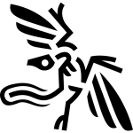

# Opteryx

### Query your data, no database required

**Opteryx is a SQL Engine written in Python, designed for cloud-native environments.**

### [Documentation](http://docs.opteryx.info/) | [Examples](https://github.com/mabel-dev/opteryx/tree/main/notebooks) | [Contributing](http://docs.opteryx.info/Contributor%20Guide/01%20Guide/)

## Use Cases

- Using SQL to query data written by another process, such as logs
- A low-cost option to allow hundreds of analysts to each have part-time databases
- Running a query engine in a serverless environment
- Building a platform to allow time-travel and temporal queries

## Features

### Scalable

Designed to run in Knative and similar environments like Google Cloud Run, Opteryx can scale down to zero, and scale up to respond to thousands of concurrent queries within seconds.

### High Availability

[Shared Nothing](https://en.wikipedia.org/wiki/Shared-nothing_architecture) design means each query can run in a separate container instance making it nearly impossible for a rogue query to affect any other users. _(compute and storage can be shared)_

If a cluster, region or datacentre is unavailable, if you have instances able to run in another location, Opteryx will keep responding to queries. _(inflight queries may not be recovered)_

### Query In Place

With Opteryx, if the engine can see and understand the data you can run queries against it. Saving you from the cost and effort of maintaining duplicates your data into a common store.

You can store your data in parquet files on disk or Cloud Storage, and in MongoDB or Firestore and access all of these data in the same query.

### Bring your own Files

Opteryx supports many popular data formats, including Parquet, ORC, Feather and JSONL, stored on local disk or on Cloud Storage. You can mix-and-match formats, so one dataset can be Parquet and another JSONL, and Opteryx will be able to JOIN across them.

### Consumption-Based Billing Friendly

Opteryx is perfect for deployments to environments which are pay-as-you-use, like Google Cloud Run. Great for situations where you low-volume usage, or many environments, where the costs of many traditional database deployment can quickly add up.

### Python Native

Opteryx is an Open Source Python library, it quickly and easily integrates into Python code, including Jupyter Notebooks, so you can start querying your data within a few minutes.

### Time Travel

Designed for data analytics in environments where decisions need to be replayable, Opteryx allows you to query data as at a point in time in the past to replay decision algorithms against facts as they were known in the past. _(data must be structured to enable temporal queries)_

### Schema Evolution

Opteryx supports some change to schemas and paritioning without requiring any existing data to be updated. _(data types can only be changed to compatitble types)_

## Get Started

**Install from PyPI**

~~~bash
pip install opteryx
~~~

**Usage**

Example usage, querying one of the internal example datasets.

~~~python
import opteryx

conn = opteryx.connect()
cur = conn.cursor()
cur.execute("SELECT * FROM $planets;")
for row in cur.fetchall():
    print(row["name"])
~~~

For more example usage, see [Exmaple Notebooks](https://github.com/mabel-dev/opteryx/tree/main/notebooks) and the [Getting Started Guide](https://mabel-dev.github.io/opteryx/02%20Getting%20Started/).

## Community

**How do I get Support?**

For support join our [Gitter Community](https://gitter.im/mabel-opteryx/community).

**How Can I Contribute?**

All contributions, [bug reports](https://github.com/mabel-dev/opteryx/issues/new/choose), documentation improvements, enhancements, and [ideas](https://github.com/mabel-dev/opteryx/discussions) are welcome.

Want to help build Opteryx? See the [Contribution](http://docs.opteryx.info/Contributor%20Guide/01%20Guide/) and [Set Up](http://docs.opteryx.info/Contributor%20Guide/90%20Debian%20%28Ubuntu%29/) Guides.

## Security

See the project [Security Policy](SECURITY.md) for information about reporting vulnerabilities.

## License

## Status

Opteryx is in beta. Beta means different things to different people, to us, being beta means:

- Core functionality has good regression test coverage to help ensure stability
- Some edge cases may have undetected bugs
- Performance tuning may be incomplete
- Changes are focused on feature completion, bugs, performance, reducing debt, and security
