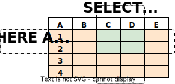

# SQL Introduction

## Overview

This page provides an overview of how to perform simple operations in SQL. This tutorial is only intended to give you an introduction and is not a complete tutorial on SQL. This tutorial is reworked from the [DuckDB](https://duckdb.org/docs/sql/introduction) tutorial.

All queries use the internal sample NASA datasets and should work regardless of the data your installation and set up has access to.

## Concepts

[Opteryx](https://github.com/mabel-dev/opteryx) is a system for querying ad hoc data stored in files as [relations](https://en.wikipedia.org/wiki/Relation_(database)). A relation is mathematical term for a data table.

Each relation is a named collection of rows, organized in columns, each column should be a common datatype. 

As an ad hoc query engine, the relations and their schema do not need to be predefined, they are determined at the time the query is run. This is one of the reasons Opteryx cannot be considered a RDBMS (relational database management system), even though it can be used to query data using SQL.

## Querying Relations

To retrieve data from a relation, the relation is queried using a SQL `SELECT` statement. Basic statements are made of three parts; the list of columns to be returned and the list of relations to retrieve data from, and optional clauses to shape and filter the data that is returned.

~~~sql
SELECT *
  FROM $planets;
~~~

The `*` is shorthand for "all columns", by convention keywords are capitalized, and `;` optionally terminates the query.

~~~sql
SELECT id,
       name
  FROM $planets
 WHERE name = 'Earth';
~~~

The output of the above query should be 

~~~
 id	|  name
----+-------
  3	| Earth
~~~

You can write functions, not just simple column references, in the select list. For example, you can write:

~~~sql
SELECT id, 
       UPPER(name) AS uppercase_name
  FROM $planets
 WHERE id = 3;
~~~

This should give:

~~~
 id	| uppercase_name
----+----------------
  3	| EARTH
~~~

Notice how the `AS` clause is used to relabel the output column. (The `AS` clause is optional.)

A query can be “qualified” by adding a `WHERE` clause that specifies which rows are wanted. The `WHERE` clause contains a Boolean (truth value) expression, and only rows for which the Boolean expression is true are returned. The usual Boolean operators (`AND`, `OR`, and `NOT`) are allowed in the qualification. 

The `SELECT` clause can be thought of as choosing which columns we want from the relation, and the `WHERE` clause as choosing which rows we want from the relation.

For example, the following the planets with fewer than 10 moons and a day longer than 24 hours:

~~~sql
SELECT *
  FROM $planets
 WHERE lengthOfDay > 24
   AND numberOfMoons < 10;
~~~

Result:

~~~
name  	| lengthOfDay | numberOfMoons
--------+-------------+---------------
Mercury	|      4222.6 |             0
Venus 	|        2802 |             0
Mars  	|        24.7 |             2
Pluto 	|       153.3 |             5
~~~

The order of results are not guaranteed and should not be relied upon. If you request the results of the below query, you might get the Mercury or Venus in either order. 

!!! note
    The same query, of the same data in the same version of Opteryx will likely to return results in the same order, don't expect to test result order non-determinism by rerunning the query millions of times and looking for differences. These differences may manifest over different versions, or from subtle differences to the query statement or data.

~~~sql
SELECT name,
       numberOfMoons
  FROM $planets
 WHERE numberOfMoons = 0;
~~~

Result:

~~~
name  	| lengthOfDay | numberOfMoons
--------+-------------+---------------
Mercury	|      4222.6 |             0
Venus   |        2802 |             0
~~~

But you’d always get the results shown above if you do:

~~~sql
SELECT name,
       numberOfMoons
  FROM $planets
 WHERE numberOfMoons = 0
 ORDER BY name;
~~~

You can request that duplicate rows be removed from the result of a query:

~~~sql
SELECT DISTINCT planetId
  FROM $satellites;
~~~

Result:

~~~
planetId
--------
       3
       4
       5
       6
       7
       8
       9
~~~

Here again, the result row ordering might vary. You can ensure consistent results by using `DISTINCT` and `ORDER BY` together:

~~~sql
SELECT DISTINCT planetId
  FROM $satellites
 ORDER BY planetId;
~~~

## Joins Between Relations

So far our queries have only accessed one relation at a time. Queries can access multiple relations at once, or access the same relation in such a way that multiple rows of the relation are being processed at the same time. A query that accesses multiple rows of the same or different relations at one time is called a join query. 

As an example, say you wish to list all the _$satellites_ records together with the planet they orbit. To do that, we need to compare the _planetId_ of each row of the _$satellites_ relation with the _id_ column of all rows in the _$planets_ relation, and return the pairs of rows where these values match.

This would be accomplished by the following query:

~~~sql
SELECT *
  FROM $satellites, $planets
 WHERE planetId = $planets.id;
~~~

~~~
$satellites.id | planetId | $satellites.name | ...
---------------+----------+------------------+----
             1 |        3 | Moon             |
             2 |        4 | Phobos           |
             3 |        4 | Deimos           |
             4 |        5 | Io               |
             5 |        5 | Europa           |

(more rows and columns)
~~~

Observe two things about the result set:

There are no result row for the planets of Mercury or Venus (_planetIds_ 1 and 2). This is because there is no matching entry in the _$satellites_ relation for these planets, so the join ignores the unmatched rows in the _$planets_ relation.

Each of the relations being joined have an _id_ and a _name_ column, to ensure it is clear which relation the value being displayed is from, columns with clashing names are qualified with the relation name.

To avoid abiguity and problems in the future if new columns are added to relations, it is good practice to qualify column names in join conditions:

~~~sql
SELECT *
  FROM $satellites, $planets
 WHERE $satellites.planetId = $planets.id;
~~~

Will return the same result as above, but be more resistant to future failure.

Join queries of the kind seen thus far can also be written in this alternative form:

~~~sql
SELECT *
  FROM $satellites 
 INNER JOIN $planets 
         ON $satellites.planetId = $planets.id;
~~~

The Opteryx planner currently uses a different execution strategy for these two similar queries, the explicit `INNER JOIN` style generally executes faster.

Now we will figure out how we can get the Mercury and Venus records back in. What we want the query to do is to scan the _$planets_ relation and for each row to find the matching _$satellites_ row(s). If no matching row is found we want some “empty values” to be substituted for the _$satellites_ relations columns. This kind of query is called an outer join. (The joins we have seen so far are inner joins and cross joins.) The command looks like this:

~~~sql
SELECT *
  FROM $satellites 
 LEFT OUTER JOIN $planets 
         ON $satellites.planetId = $planets.id;
~~~
  
~~~
$satellites.id | planetId | $satellites.name | ...
---------------+----------+------------------+----
               |        1 |                  |
               |        2 |                  |
             1 |        3 | Moon             |
             2 |        4 | Phobos           |
             3 |        4 | Deimos           |
             4 |        5 | Io               |
             5 |        5 | Europa           |

(more rows and columns)
~~~

Using the `LEFT OUTER JOIN` will mean the relation mentioned on the left of the join operator will have each of its rows in the output at least once, whereas the relation on the right will only have those rows output that match some row of the left relation. When outputting a left-relation row for which there is no right-relation match, empty (null) values are substituted for the right-relation columns. 

!!! note
    How null values are displayed may be different between different systems, common approaches are to display an empty cell or display 'none' or 'null' in an alternate format (e.g. italics or different font color). This is not controlled by Opteryx.

## Aggregate Functions

Like most query engines and databases, Opteryx supports aggregate functions. An aggregate function computes a single result from multiple input rows. For example, there are aggregates to compute the `COUNT`, `SUM`, `AVG` (average), `MAX` (maximum) and `MIN` (minimum) over a set of rows.

<!---
As an example, we can find the highest low-temperature reading anywhere with:

SELECT max(temp_lo) FROM weather;
 max
-----
  46
(1 row)
If we wanted to know what city (or cities) that reading occurred in, we might try:

SELECT city FROM weather WHERE temp_lo = max(temp_lo);     -- WRONG
but this will not work since the aggregate max cannot be used in the WHERE clause. (This restriction exists because the WHERE clause determines which rows will be included in the aggregate calculation; so obviously it has to be evaluated before aggregate functions are computed.) However, as is often the case the query can be restated to accomplish the desired result, here by using a subquery:

SELECT city FROM weather
    WHERE temp_lo = (SELECT max(temp_lo) FROM weather);
     city
---------------
 San Francisco
(1 row)
This is OK because the subquery is an independent computation that computes its own aggregate separately from what is happening in the outer query.

Aggregates are also very useful in combination with GROUP BY clauses. For example, we can get the maximum low temperature observed in each city with:

SELECT city, max(temp_lo)
    FROM weather
    GROUP BY city;
     city      | max
---------------+-----
 Hayward       |  37
 San Francisco |  46
(2 rows)
Which gives us one output row per city. Each aggregate result is computed over the table rows matching that city. We can filter these grouped rows using HAVING:

SELECT city, max(temp_lo)
    FROM weather
    GROUP BY city
    HAVING max(temp_lo) < 40;
  city   | max
---------+-----
 Hayward |  37
(1 row)
which gives us the same results for only the cities that have all temp_lo values below 40. Finally, if we only care about cities whose names begin with “S”, we can use the LIKE operator:

SELECT city, max(temp_lo)
    FROM weather
    WHERE city LIKE 'S%'            -- (1)
    GROUP BY city
    HAVING max(temp_lo) < 40;
More information about the LIKE operator can be found here.

It is important to understand the interaction between aggregates and SQL’s WHERE and HAVING clauses. The fundamental difference between WHERE and HAVING is this: WHERE selects input rows before groups and aggregates are computed (thus, it controls which rows go into the aggregate computation), whereas HAVING selects group rows after groups and aggregates are computed. Thus, the WHERE clause must not contain aggregate functions; it makes no sense to try to use an aggregate to determine which rows will be inputs to the aggregates. On the other hand, the HAVING clause always contains aggregate functions.

In the previous example, we can apply the city name restriction in WHERE, since it needs no aggregate. This is more efficient than adding the restriction to HAVING, because we avoid doing the grouping and aggregate calculations for all rows that fail the WHERE check.
--->