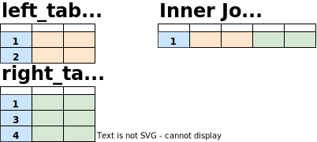

# Joins

Joins allow you to combine data from multiple relations into a single relation.

## CROSS JOIN

~~~
FROM left_table CROSS JOIN right_table
~~~
~~~
FROM left_table, right_table
~~~

A `CROSS JOIN` returns the Cartesian product (all combinations) of two relations. Cross joins can either be specified using the explicit `CROSS JOIN` syntax or by specifying multiple relations in the `FROM` clause.

~~~sql
SELECT *
  FROM left_table
 CROSS JOIN right_table;
~~~

The size of the resultant dataset when using `CROSS JOIN` is length of the two datasets multiplied together (2 x 3 = 6, in the pictural example), which can easily result in extremely large datasets. When an alternate join approach is possible, it will almost always perform better than a `CROSS JOIN`.

## INNER JOIN

~~~
FROM left_table INNER JOIN right_table [ ON condition | USING (column) ]
~~~
~~~
FROM left_table JOIN right_table [ ON condition | USING (column) ]
~~~

An `INNER JOIN` returns rows from both relations where the value in the joining column of one relation matches the value in the joining column of the other relation. Inner joins can either be specified using the full `INNER JOIN` syntax or the shorter `JOIN` syntax, and the joining column specified using `ON condition` or `USING(column)` syntax.

~~~sql
SELECT *
  FROM left_table
 INNER JOIN right_table
    ON left_table.column_name = right_table.column_name;
~~~

In this example, the blue column is used as the joining column in both relations. Only the value `1` occurs in both tables so the resultant relation is the combination of the row with `1` in _right_table_ and the row with `1` in _left_table_.

## LEFT JOIN

A `LEFT JOIN` selects all records from the left table (table1), and the matching records from the right table (table2). The result is 0 records from the right side, if there is no match.

~~~
FROM left_table LEFT JOIN right_table ON condition
~~~
~~~
FROM left_table LEFT OUTER JOIN right_table ON condition
~~~

~~~sql
SELECT *
  FROM left_table
  LEFT OUTER JOIN right_table
    ON left_table.column_name = right_table.column_name;
~~~

## FULL JOIN

~~~
FROM left_table FULL JOIN right_table ON condition
~~~
~~~
FROM left_table FULL OUTER JOIN right_table ON condition
~~~

The `FULL JOIN` keyword returns all records when there is a match in left (table1) or right (table2) table records.

~~~sql
SELECT *
  FROM left_table
  FULL OUTER JOIN right_table
    ON left_table.column_name = right_table.column_name;
~~~

