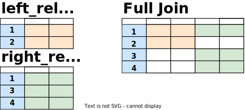

# Joins

Joins allow you to combine data from multiple relations into a single relation.

## CROSS JOIN

~~~
FROM left_relation CROSS JOIN right_relation
~~~
~~~
FROM left_relation, right_relation
~~~

A `CROSS JOIN` returns the Cartesian product (all combinations) of two relations. Cross joins can either be specified using the explicit `CROSS JOIN` syntax or by specifying multiple relations in the `FROM` clause.

~~~sql
SELECT *
  FROM left_relation
 CROSS JOIN right_relation;
~~~

The size of the resultant dataset when using `CROSS JOIN` is length of the two datasets multiplied together (2 x 3 = 6, in the pictorial example), which can easily result in extremely large datasets. When an alternate join approach is possible, it will almost always perform better than a `CROSS JOIN`.

## INNER JOIN

~~~
FROM left_relation [ INNER ] JOIN right_relation < ON condition | USING (column) >
~~~

An `INNER JOIN` returns rows from both relations where the value in the joining column of one relation matches the value in the joining column of the other relation. Inner joins can either be specified using the full `INNER JOIN` syntax or the shorter `JOIN` syntax, and the joining logic specified using `ON condition` or `USING(column)` syntax.

~~~sql
SELECT *
  FROM left_relation
 INNER JOIN right_relation
    ON left_relation.column_name = right_relation.column_name;
~~~

In this example, the blue column is used as the joining column in both relations. Only the value `1` occurs in both relations so the resultant dataset is the combination of the row with `1` in _right_relation_ and the row with `1` in _left_relation_.

## LEFT JOIN

~~~
FROM left_relation LEFT [ OUTER ] JOIN right_relation ON condition
~~~

A `LEFT JOIN` returns all rows from the left relation, and rows from the right relation where there is a matching row, otherwise the fields for the right relation are populated with `NULL`.

~~~sql
SELECT *
  FROM left_relation
  LEFT OUTER JOIN right_relation
    ON left_relation.column_name = right_relation.column_name;
~~~

## RIGHT JOIN

A `RIGHT JOIN` is the same as a `LEFT JOIN` with the relations swapped.

## FULL JOIN

~~~
FROM left_relation FULL [ OUTER ] JOIN right_relation ON condition
~~~

The `FULL JOIN` keyword returns all rows from the left relation, and all rows from the right relation. Where they have a matching value in the joining column, the rows will be aligned, otherwise the fields will be populated with `NULL`.

~~~sql
SELECT *
  FROM left_relation
  FULL OUTER JOIN right_relation
    ON left_relation.column_name = right_relation.column_name;
~~~

